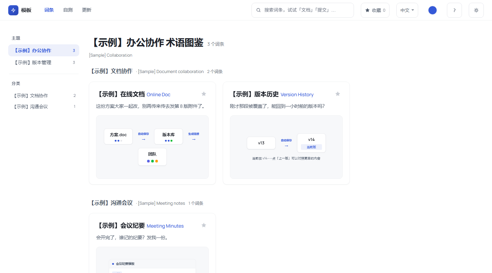
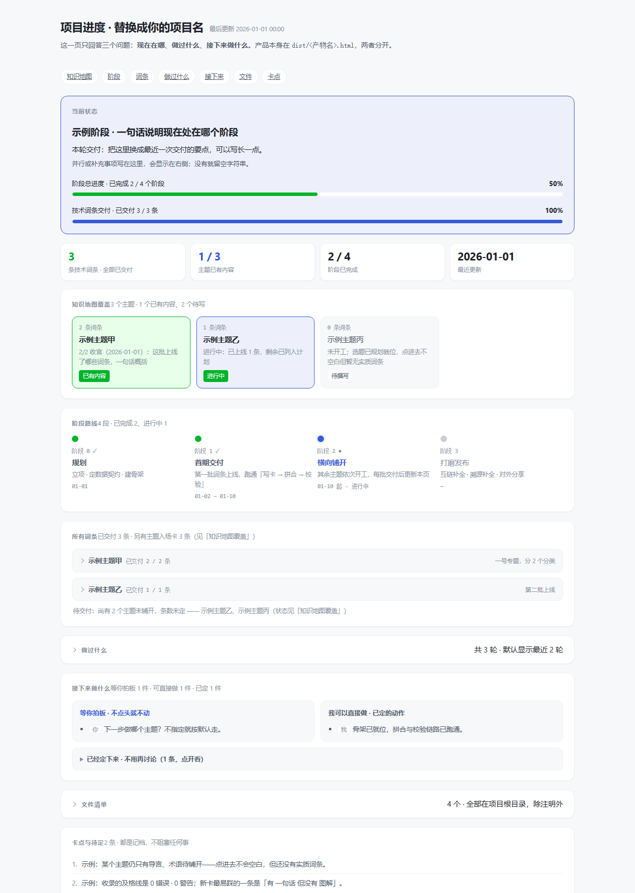

# 词条图鉴模板 glossary-atlas-template

**单文件、零外部请求的图鉴引擎 + 内容 / 工程双线骨架。** 拿它派生一个新主题的「术语图鉴」：内容线只写 Markdown，工程线一条命令出成品。

> ⚠️ **本仓库是模板骨架，不是可运行成品**：不含任何内容数据，因此 clone 后直接构建会报错——这是预期状态，跑一次下节的「起步」即可。
> 本地文件夹名用中文「词条图鉴模板」，仓库名用英文 `glossary-atlas-template`，两者是同一份东西。

Node.js（实测 v24）· 零 npm 依赖 · [MIT](LICENSE)



<sub>示例站点：跑完下面的「起步」，再写几条自己的卡片就是这个样子（图为演示数据，本仓库不含内容数据）。</sub>

## 快速开始

**人类**：在 GitHub 页面点 **Use this template → Create a new repository**，得到属于你自己的新仓库。
**Agent / 命令行**：直接 clone（模板仓库没有你需要继承的提交历史）。

```bash
git clone https://github.com/Columbinagi/glossary-atlas-template.git 我的图鉴
cd 我的图鉴
node engineering/起步.mjs      # 一条命令：建骨架 → 拼合 → 校验，期望看到「校验全部通过」
node engineering/预览服务.mjs   # 本地预览 http://localhost:8123/
```

`起步.mjs` 做四件事（已存在的文件一律跳过，可反复运行）：建 `dist/`、写一张示例卡片、建 `content/词条清单.md`、建 `content/更新日志.md`；随后自动跑拼合与校验。跑通后站点产出在 `dist/`，用浏览器打开即见效果。

**接下来**：改 `content/站点配置.js`（品牌名、主题、分类）→ 把示例卡片换成你自己的内容 → 照「怎么用它派生」第 2 条改掉校验里的搜索探针。行号与改法见 [docs/派生与排错.md](docs/派生与排错.md)。

## 目录结构

```
词条图鉴模板/
├── CONTRACT.md                 内容线与工程线的数据契约 —— 派生时读一遍，一般不改
├── CHANGELOG.md                本模板自身的版本变化
├── content/                    【内容线】日常唯一要写的地方
│   ├── 站点配置.js              品牌 / 主题 / 分类 / 主题色 —— 派生时必改
│   ├── 内容规范.md              字段表、写作纪律、编号规则 —— 派生时改示例与行业名
│   ├── 知识库/                  一卡一文件的词条卡片（起步脚本会放一张示例卡）
│   ├── 知识库-en/               英文卡片，可选，按 id 与中文卡配对
│   ├── 词条清单.md              唯一选题依据，校验硬闸门
│   └── 更新日志.md              Keep a Changelog 风格
├── engineering/                【工程线】只用 Node 内置模块
│   ├── 起步.mjs                 一条命令把骨架变成能跑的项目
│   ├── 拼合.mjs                 content/ → dist/ 单文件站点
│   ├── 校验.mjs                 交付前自检，要求「0 错误 · 0 警告」
│   ├── 体检.mjs                 窄屏排版体检：16 档宽度 × 4 视图（`--lang=en` 扫英文界面；需无头 Chrome）
│   ├── lib-md.mjs               Markdown 知识库解析器（拼合与校验共用）
│   ├── 收录草稿.mjs             草稿 → 知识库
│   ├── 重排编号.mjs             编号压实（`--step=N`），日常不用
│   └── 预览服务.mjs             本地静态服务器
├── skills/                     AI 助手用的操作规程：生成卡片 / 收录上线
├── templates/                  母版与可复用页面（都不是构建脚本读的，按需复制）
│   ├── 词条图鉴模板-v5.html     单文件引擎母版（含 PYI 拼音表）—— 可直接双击打开预览
│   └── 项目进度模板-v1.html     进度看板模板（只改数据区，零外部请求）
├── docs/派生与排错.md           接线点行号、常见红字、源项目痕迹对照（README 配图在 docs/img/）
```

## 怎么用它派生

必改 5 处，每条的**行号、代码改法、排错**见 [docs/派生与排错.md](docs/派生与排错.md)。
真正挡住第一跑的只有第 2 条（起步脚本放的示例卡片正好绕过它）；第 1 条三处硬编码同值、不报错，属命名一致性缺陷；第 3 条在你写出新术语缺字时才红。

1. **产物文件名写死在 3 个脚本里**（`拼合.mjs:17`、`校验.mjs:17`、`预览服务.mjs:33`）→ 三处同值所以不报错，但改了品牌名后产物名不会跟着走；建议改成由 `SITE_META.brandName` 推导。
2. **校验的搜索探针写死**（`校验.mjs:301` 的 `['永磁','ycdj']` + `#topic=t5`）→ 换成你首条词条的名字与拼音首字母串，否则固定 2 条红、退出码 1。
3. **引擎的 PYI 拼音表只覆盖源内容用字**（母版里的 `var PYI`，v1.1.3 时在 `:3051`；**行号会随母版增行漂移，搜 `var PYI` 最稳**）→ 校验会点名缺哪些字，按提示补齐。
4. **品牌名与产物名散落在 7 个文件、12 行里** → 完整清单见 docs。
5. **`内容规范.md` 与 `skills/` 的正文**是按源项目写的 → 结构可沿用，举例的术语、主题名、行业名要换成你的。

派生完成后，在自己的 README 或 `CONTRACT.md` 里记一行「派生自 glossary-atlas-template v1.1.3（commit &lt;短哈希&gt;）」，将来模板升级才追得回差异。

### 骨架的权威在哪（已经派生过就看这里）

- **本仓库是骨架的权威来源**：引擎母版（`templates/`）与工程线脚本（`engineering/`）的改动**先在本仓库落地**，记进 [CHANGELOG.md](CHANGELOG.md) 的「骨架变更」，再向外分发。
- **派生项目是消费者**：按 CHANGELOG 的骨架变更逐条对照同步，**只改骨架，不要覆盖你的 `content/`**。
- **反向纪律**：如果你在自己的活动项目里改了骨架（真实内容在那边，很多问题只有它跑得出来），**当天把它搬回本仓库**并记一行——否则两边会分叉。
- **为什么写这条**：v1.1.2 的顶栏修复与另一个项目的拼音补字，正是「两边各改一行、互不知情」造成的分叉：模板缺拼音、项目缺修复。同步一次的成本远低于"谁都以为自己是最新"。

比对两边是否已经分叉，最快是比哈希（各自的仓库里各跑一次，看输出是否相同）：

```bash
git hash-object templates/词条图鉴模板-v5.html
```

改完样式之后，跑一次 `node engineering/体检.mjs`（详见 [docs/派生与排错.md](docs/派生与排错.md) 第五节）——窄屏问题只有扫过才知道。

### 附：项目进度看板（可选）

`templates/项目进度模板-v1.html` 是一个**单文件进度看板**：顶部「现在在哪」三句 + 阶段进度条，下面依次是知识地图覆盖、阶段路线、所有词条、做过什么、接下来做什么、文件清单、卡点与待定。

- **用法**：拷到项目的 `docs/项目进度.html`，只改文件里的 `DATA` 数据区（渲染代码不用动），双击即开；
- 零依赖、零外部请求，也可以直接丢给浏览器；
- 它**不参与构建**，改它不会影响站点产物；字段形状照抄文件里的示例数据即可。



<sub>进度看板：只改文件里的 `DATA` 数据区，整页自己重排。</sub>

## 环境要求

- **Node.js**：唯一硬依赖，零第三方包（没有 `package.json`，不需要 `npm install`）。
- **无头 Chrome（可选）**：`校验.mjs:18` 写死了 Chrome 默认安装路径，用来自检站点的 `#debug` 与搜索语料。没有它（或装在别处）时这几项会打印「⏸ 需外部验证」并单独计数，**不计入失败**；要自动化就把这行改成你机器上的真实路径。
  ⚠️ 由此带来一个判定盲区：**退出码 0 并不总等于站点自检真的过了**——在没装 Chrome 的机器上，同一份代码会得到相反的通过口径（独立测试实测）。
- 浏览器：任意现代浏览器。站点是单文件，双击 `dist/<产物名>.html` 即可打开。

## 版本与来源

- **当前版本**：`v1.1.3` —— 逐版变更见 [CHANGELOG.md](CHANGELOG.md)，可下载的历史版本见 [Releases](https://github.com/Columbinagi/glossary-atlas-template/releases)。
- **怎么更新到新版**：模板是「拷骨架」而不是「装依赖」——把 `templates/`、`engineering/`、`skills/`、`CONTRACT.md`、`.gitattributes`、`.gitignore` 与新版逐个对比后自行合并，**不要覆盖你的 `content/`**；行号与改法见 [docs/派生与排错.md](docs/派生与排错.md)。
- **来源**：骨架 14 个文件自一个已在运行的图鉴项目抽出，源提交 `af88476`。其中 **13 个与 `af88476` 逐字节一致**（SHA256 全等）；`templates/词条图鉴模板-v5.html` 自 v1.1.2 起不再逐字节一致，历次改动是顶栏语言按钮折行（561–960px）、顶栏导航项与主题色圆点的垂直对齐（偏 5px / 9px）、词条页「本页目录」右缘渐隐——逐条来历与实测见 [CHANGELOG.md](CHANGELOG.md)。**未含该项目任何内容数据、进度文档与产物**；文件注释里留有指向源项目内部文档的悬空引用，清单同见 [docs/派生与排错.md](docs/派生与排错.md) 第三节。
- **派生时请在自己项目里记一行**「派生自 glossary-atlas-template v1.1.3（commit &lt;短哈希&gt;）」—— 将来模板升级，这条记录是唯一能对齐差异的线索。

## 许可证

[MIT](LICENSE) © 2026 凪の海 (Columbinagi) —— 随便用、随便改、随便再分发，保留版权声明即可。
